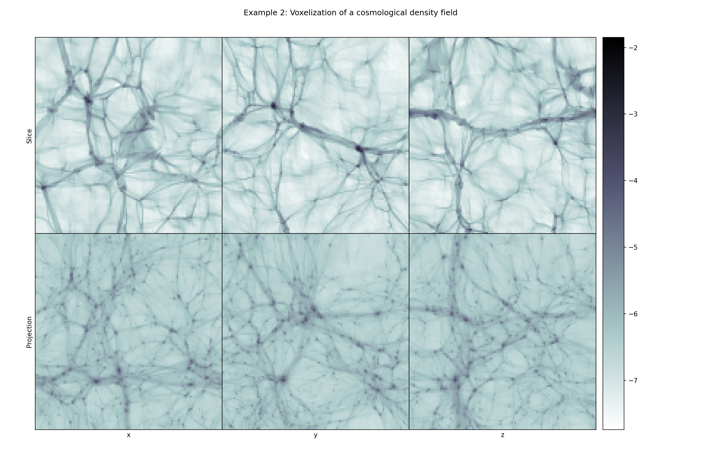

In this repository we can collect some code relating using phase space sheet ideas as in [the original phase space sheet paper](https://arxiv.org/abs/1111.3944). 

We also repeat the example from Devon Powell's [PSI](https://github.com/devonmpowell/PyPSI) software that uses exact deposit to grid the phase space sheet density. 

