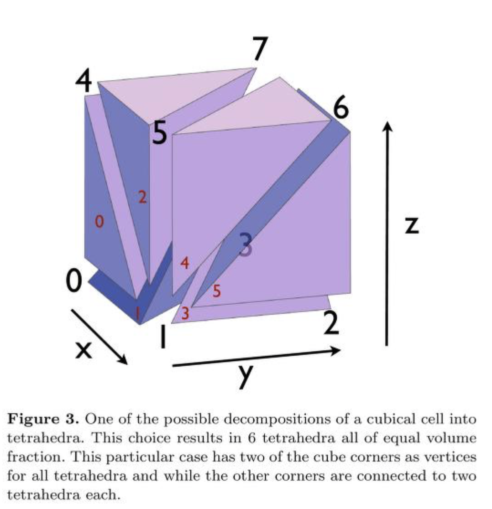
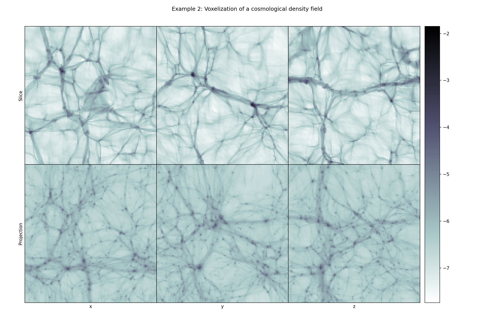

# Lagrangian Phase-Space Sheets, made easy

A small, fast, well-tested toolkit for the **phase-space-sheet** method of
analysing dark-matter dynamics, following
[Abel, Hahn &amp; Kaehler (2012)](https://arxiv.org/abs/1111.3944) and
[Hahn, Abel &amp; Kaehler (2013)](https://arxiv.org/abs/1210.6652).

The core idea: cold dark matter lives on a smooth 3-D sheet in 6-D phase space
that gravity only ever *folds*, never tears. Tracking the sheet's connectivity
lets us reconstruct density, velocity and caustics **exactly between particles**,
instead of guessing from a point cloud.



## Quick start

```python
import lpss
from lpss import tetrahedra as tet

# 1. Build a self-contained universe with the Zel'dovich approximation
mesh = lpss.LagrangianMesh.zeldovich(n=64, boxsize=100.0, growth=2.0, seed=42)

# 2. Tessellate the sheet into 6 tetrahedra per cell and measure it
vol = tet.tet_volumes(mesh)            # (64,64,64,6) signed volumes
rho = tet.sheet_density(mesh, ngrid=256, split=4)   # adaptive density grid

# 3. Fourier-upsample the displacement field by an integer factor per dimension
fine = lpss.upsample_mesh(mesh, 2)     # 2x per dim -> 8x particles
x, v = fine.positions_flat(), fine.velocities_flat()   # upsampled x and v

# ...or use a real Gadget-2 snapshot instead of Zel'dovich
snap = lpss.read_gadget("snapshot_010")
sim  = lpss.LagrangianMesh.from_gadget(snap)
```

The guided tour is the notebook
[`LagrangianPhaseSpaceSheetEasy.ipynb`](./LagrangianPhaseSpaceSheetEasy.ipynb),
which builds everything up from a single line of cosmology to a real simulation.

## The `lpss` package

| module | what it does |
| ------ | ------------ |
| `lpss.lagrangian` | `LagrangianMesh` &mdash; the displacement field `Psi(q)`, the central object. Build it from Zel'dovich, raw positions, or a Gadget snapshot. Detects grid handedness automatically. |
| `lpss.tetrahedra` | Tessellate into 6 tetrahedra/cell: volumes, centroids, densities, sheet refinement, CIC deposit. Periodic, **numba-accelerated and parallel**, with a vectorised NumPy fallback. |
| `lpss.fourier` | Spectral up-sampling of the Lagrangian mesh by an **integer factor per dimension** (exact for the band-limited displacement/velocity fields). |
| `lpss.gadget` | Dependency-free Gadget-2 (`SnapFormat=1`) reader &mdash; no `yt` required. |

## Performance: numba vs NumPy

Every tetrahedron operation has a compiled, multi-threaded numba kernel and an
equivalent vectorised NumPy implementation; the library picks the faster one
automatically and falls back gracefully when numba is absent. On a `64^3` mesh
(1.5 M tetrahedra):

| operation       | NumPy   | numba  | speed-up |
| --------------- | ------- | ------ | -------- |
| `tet_volumes`   | 127 ms  | 14 ms  | ~9x  |
| `tet_centroids` | 181 ms  | 27 ms  | ~7x  |
| `interp (x8)`   | 1128 ms | 125 ms | ~9x  |
| `sheet_density` | 833 ms  | 81 ms  | ~10x |

The numba kernels also use far less memory: they stream through the data with
O(1) temporaries instead of building the large intermediate arrays the
vectorised version needs. Reproduce with `python benchmark.py --compare`, or
force the NumPy path anywhere with `LPSS_DISABLE_NUMBA=1`.

## Install / run

```bash
pip install -r requirements.txt   # numpy, scipy, matplotlib, numba
python -m pytest tests/           # 15 correctness tests
```

`numba` is optional; without it the library still works via the NumPy fallback.

## Exact projected-tetrahedron deposit (optional)

For a pixel-exact density that intersects each tetrahedron with the grid
analytically, see Devon Powell's [PyPSI](https://github.com/devonmpowell/PyPSI).
`psi_test.py` shows how to call it if installed.


